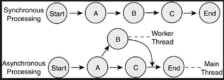
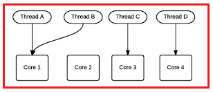
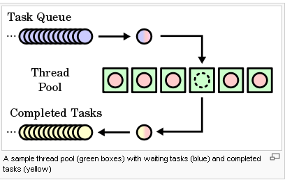
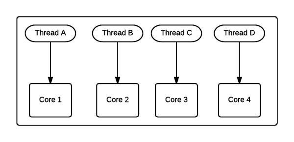

# Notes on C# 4.0 feature

## Parallelization Overview

### 1. What is Parallel Programming?

- Application is broken into pieces
- Concurrently
- Better Performance

   <br/>

- Synchronous programming
- Asynchronous programming

 <br/>



<br/>

### Advantages & Disadvantages of both programming modes

- Asynchronous Execution

  - Synchronize Tasks
  - Address Concurrency Issues
  - No Logical Sequence Anymore

<br/>

- Synchronous Execution
  - Time
  - Stop the user interface (UI) thread
  - Doesn’t use the multicore architecture

### 2. What is a Thread?

- Smallest unit of code
- multiple threads of execution
- parallel computing

<br/>

### Advantages of Multithreading or Asynchronous Programming

1. You have a program that checks dozen websites to get pricing information for a product.
2. Multithreading can also simplify your code.

### Different methods for Multithreading:

- [PLINQ](https://docs.microsoft.com/en-us/dotnet/standard/parallel-programming/introduction-to-plinq)
- [Background worker]()
- [Task Parallel Library (TPL)](https://docs.microsoft.com/en-us/dotnet/standard/parallel-programming/task-parallel-library-tpl)
- [Tasks](https://docs.microsoft.com/en-us/dotnet/api/system.threading.tasks.taskscheduler?view=net-5.0)
- [Threads]()

## Task Parallel Library

1. What is a Task Parallel Library?

- The Task Parallel Library (TPL) is a set of public types and APIs in the System.
- Threading and System.Threading.Tasks namespaces.
- The purpose of the TPL is to make developers more productive by simplifying the process of adding parallelism and concurrency to applications.

2. Why do we need Task Parallel Library in C#?

- We can’t expect our sequential program to run faster on the new processors as we know the processor technology advances means the focus is on Multicore-processors. Today’s desktop typically has 4 cores but the latest experimental multi-core chips have up to 1000 cores
- So in simple words, we can say that the multicore processor machines are now becoming standard and the aim is to improve the performance by running a program on multiple processors in parallel. So by considering the above scenario, the .NET Framework 4 introduces Task Parallel Library (TPL) that makes it easier for developers to write parallel programs that target multi-core machines (automatically use multiple processors) which improves the performance.
- Using the Task Parallel Library (TPL), we can express the parallelism in the existing sequential code, which means we can express the code as the Parallel task, which will be run concurrently on all the available processors.



## Threads Vs. Tasks

1. What is Task in C#?

- .NET framework provides Threading.Tasks class to let you create tasks and run them asynchronously.
- A task is an object that represents some work that should be done.
- The task can tell you if the work is completed and if the operation returns a result, the task gives you the result.
- The Task class represents a single operation that does not return a value and that usually executes asynchronously.



2. What is Thread?

- .NET Framework has thread-associated classes in System.Threading namespace. A Thread is a small set of executable instructions.
  

3. Why we need tasks?

- It can be used whenever you want to execute something in parallel.
- Asynchronous implementation is easy in a task, using’ async’ and ‘await’ keywords.

4. Why we need a Thread?

- When the time comes when the application is required to perform few tasks at the same time.

5. How to create a Task?

```
static void Main(string[] args)
{
    Task < string > obTask = Task.Run(() => (
        return“ Hello”));
    Console.WriteLine(obTask.result);
}

```

6. How to create a Thread ?

```
static void Main(string[] args)
{
    Thread thread = new Thread(new ThreadStart(getMyName));
    thread.Start();
}
public void getMyName() {}

```

7. Difference between Task and Thread?
   - The task can return a result. There is no direct mechanism to return the result from a thread.
   - Task supports cancellation through the use of cancellation tokens. But Thread doesn't.
   - A task can have multiple processes happening at the same time. Threads can only have one task running at a time.
   - We can easily implement Asynchronous using ’async’ and ‘await’ keywords.
   - A new Thread()is not dealing with Thread pool thread, whereas Task does use thread pool thread.
   - A Task is a higher level concept than Thread.
   - The Thread class is used for creating and manipulating a thread in Windows. A Task represents some asynchronous operation and is part of theTask Parallel Library, a set of APIs for running tasks asynchronously and in parallel.

## Parallel Extensions in .NET 4.5

- .NET 4 and Visual Studio 2010 saw the introduction of a wide range of new support for parallelism:
  1. Task Parallel Library (TPL)
  2. Parallel LINQ (PLINQ)
- Task Parallel Library
  - TPL is becoming the foundation for all parallelism, concurrency, and asynchrony in the .NET Framework.
  - That means it needs to be fast… really fast.
  - Performance in .NET 4 is already good, but a lot of effort was spent in this release improving the performance of TPL, such that just by upgrading to .NET 4, important workloads will just get faster, with no code changes or even recompilation required.
  - for example, consider a long chain of tasks, with one task continuing off another. We want to time how long it takes to set up this chain:

```
using System;
using System.Diagnostics;
using System.Threading.Tasks;
class Program
{
  static void Main()
  {
    var sw = new Stopwatch();
    while (true)
    {
      GC.Collect();
      GC.WaitForPendingFinalizers();
      GC.Collect();
      var tcs = new TaskCompletionSource<object>();
      var t = tcs.Task;
      sw.Restart();
      for (int i = 0; i < 1000000; i++)
        t = t.ContinueWith(_ => (object)null);
      var elapsed = sw.Elapsed;
      GC.KeepAlive(tcs);
      Console.WriteLine(elapsed);
    }
  }
}

```

- Parallel LINQ (PLINQ)
  - We’ve also invested effort in improving the performance of PLINQ.
  - In particular, in .NET 4 there were a fair number of queries that would fall back to running sequentially, due to a variety of internal implementation details that caused the system to determine that running in parallel would actually run more slowly than running sequentially
  - .NET 4.5 will now automatically run in parallel.
  - For example of this is a query that involves an OrderBy followed by a Take: in .NET 4, by default that query would run sequentially, and now in .NET 4.5 we’re able to obtain quality speedups for that same construction.

```
using System;
using System.Collections.Concurrent;
using System.Diagnostics;
class Program
{
    static void Main(string[] args)
    {
        while (true)
        {
            var cd = new ConcurrentDictionary<int, int>();
            var sw = Stopwatch.StartNew();
            cd.TryAdd(42, 0);
            for (int i = 1; i < 10000000; i++)
            {
                cd.TryUpdate(42, i, i – 1);
            }
            Console.WriteLine(sw.Elapsed);
        }
    }
}


```
