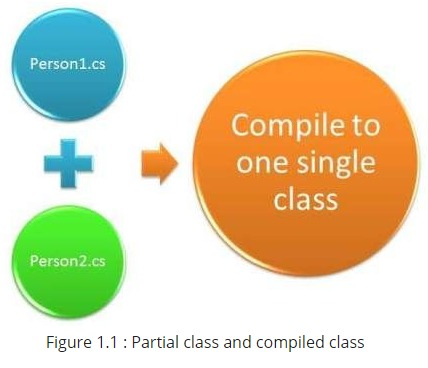
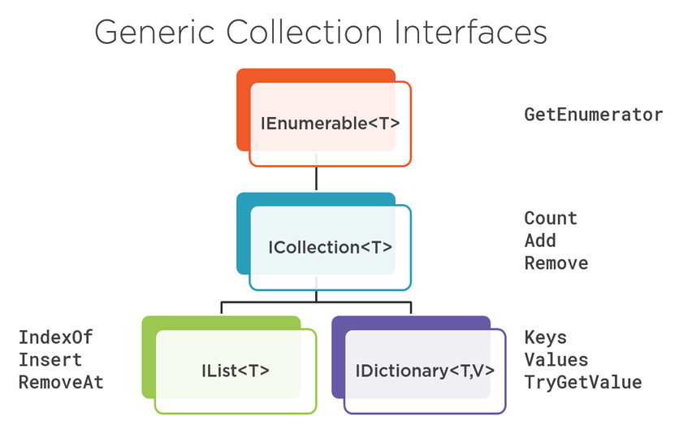

# **PARTIAL CLASS**


> **A partial class is a special feature of C#:**

<br>


* It provides a special ability to implement the functionality of a single class into multiple files and all these files are combined into a single class file when the application is compiled.

*  A partial class is created by using a partial keyword.

*  The partial keyword can also be used to split a struct or an interface over two or more files.

*  We use partial class when code of a class contains so many lines to manage.

<br>



<br>

> **ADVANTAGES OF PARTIAL CLASS**

<br>

*  Multiple developers can work simultaneously with a single class in separate.

* When working on large projects, spreading a class over separate files allows programmers to work on it simultaneously.

* Visual Studio uses partial classes to separate, automatically generated system code from the developer's code. For Example when you add a webform, two .CS files are generated.

    
<br>

```C#
public partial class Employee
{
    public void DoWork()
    {
    }
}

public partial class Employee
{
    public void GoToLunch()
    {
    }
}

```
<br>

# **ITERATORS**

* An iterator can be used to step through collections such as lists and arrays.

* C# iterator is a method. It is used to iterate the elements of a collection, array or list. An iterator uses yield return statement to return each element at a time.

* The iterator remembers the current location and in next iteration, it returns the next element.

* The return type of an iterator can be **IEnumerable`<T>`** or **IEnumerator`<T>`**.

* To stop iteration, we can use yield break statement.

<br>

```C#
static void Main()
{
    foreach (int number in SomeNumbers())
    {
        Console.Write(number.ToString() + " ");
    }
    // Output: 3 5 8
    Console.ReadKey();
}

public static System.Collections.IEnumerable SomeNumbers()
{
    yield return 3;
    yield return 5;
    yield return 8;
}
```
<br>


> **Use Of Iterators**

*	Modify the list sequence after the first foreach loop iteration.

*	Avoid fully loading a large list before the first iteration of a foreach loop. An example is a paged fetch to load a batch of table rows. Another example is the EnumerateFiles method, which implements iterators in .NET.

*	Encapsulate building the list in the iterator. In the iterator method, you can build the list and then yield each result in a loop.

<br>

> **Advantages**

* Iterators can be used as a method and get accessor.

* It can be used as operators or as a property.

* Iterators are easy to read and easy to implement.

* Iterators are used with the generic and non-generic collections.

<br>

> So to traverse the sequence of values, iterators can be used with the foreach statement. Yield can be used multiple times with iterator to return the elements. It is easy to implement and quite handy.


# **GENERICS**

* Generic is a class which allows the user to define classes and methods with the placeholder.

* The basic idea behind using Generic is to allow type (Integer, String, etc and user-defined types) to be a parameter to methods, classes, and interfaces.

* C# allows you to define generic classes, interfaces, abstract classes, fields, methods, static methods, properties, events, delegates, and operators using the type parameter and without the specific data type.

* A generic type is declared by specifying a type parameter in an angle brackets after a type name

 e.g. **TypeName`<T>`** where T is a type parameter.

 <br>

 ```C#
 //Example: Define Generic Class

 class DataStore<T>
{
    public T Data { get; set; }
}
 ```

 ```C#
 // Generic Class with Multiple Type Parameters
class KeyValuePair<TKey, TValue>
{
    public TKey Key { get; set; }
    public TValue Value { get; set; }
}
```
<br>


 > **Advantages of Generics**
 <br>

 
 * **Reusability:** You can use a single generic type definition for multiple purposes in the same code without any alterations.

* **Performance:** Generic types provide better performance as compared to normal system types because they reduce
 the need for boxing, unboxing, and typecasting of variables or objects.

 * **Type Safety:** Generic data types provide better type safety, especially in the case of collections.
 
 <br>

 
 


