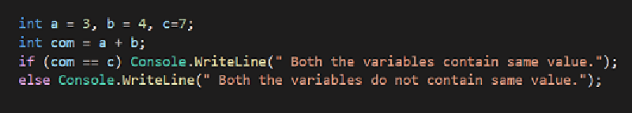
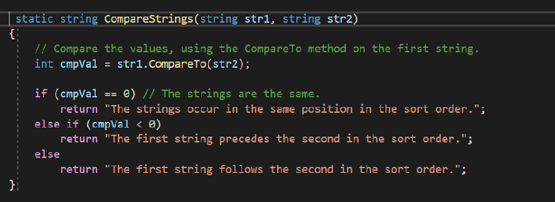
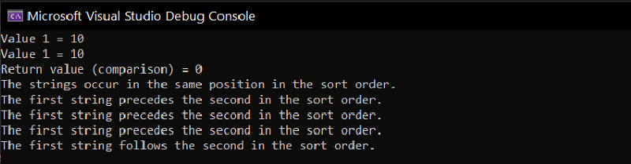

# 5. Comparing ==, Equals, ReferenceEquals and CompareTo #

- We use Equality operators/methods to compare two or more values with each other.
- There are 4 methods of checking the equivalence of the objects:
    1. Equality operator ==
    2. Equals()
    3. ReferenceEquals()
    4. CompareTo()

## 1. Equality operator == ##

- For predefined value types, the **equality operator (==)** returns true if the values of its operands are equal, false otherwise. For reference types other than string, == returns true if its two operands refer to the same object. For the string type, == compares the values of the strings.
- The operator method is static. It isn’t an instance member. It isn’t virtual. The decision to use it or not is done entirely at compile time.
- Reference types are handled differently; == by default compares if the two variable are references to the same object. The contents of the object doesn’t matter.
- The *string* type is an exception. It is a reference type stored on the heap, but everything possible has been done to make it behave like a value type. It is immutable. == compares the contents of the strings.
- For the == operator, if any of the operands is not a number (**Double.NaN or Single.NaN**), the result of operation is false. That means that the NaN value is neither greater than, less than, nor equal to any other double (or float) value, including NaN.
- User-defined struct types don't support the == operator by default. To support the == operator, a user-defined struct must overload it.

**Note** :

- *NaN*  standing for Not a Number, is a member of a numeric data type that can be interpreted as a value that is undefined or unrepresentable.
- A method or operator returns NaN when the result of an operation is undefined. For example, the result of dividing zero by zero is NaN.

- **Example** :Consider the following code.

     

- Here, we are comparing com variable and c variable. The if statement returns true if both are equal(which is happening in this example), otherwise it returns false.
- The output of the above code :

    

## 2. Equals() ##

- In C#, Equals(String, String) is a String method.
- It is used to determine whether two String objects have the same value or not.
- Basically, it checks for equality. If both strings have the same value, it returns true otherwise returns false.
- This method is different from Compare and CompareTo methods. This method compares two string on the basis of contents.
- Equals() method are used to compare two value type data items or reference type data items.the Equals() method   compares the contents of a string.
- Equals() method compares only contents.
- **Syntax** bool string.Equals(string str1, string str2);
**Parameters**:
    1. str1: It is the first string to compare.
    2. str2: It is the second string to compare.

- **Example** : Consider the following code.

    

- The output of the above code :

    

## 3. ReferenceEquals() ##

- Object.ReferenceEquals() Method is used to determine whether the specified Object instances are the same instance or not.
- This method cannot be overridden. So, if a user is going to test the two objects references for equality and he is not sure about the implementation of the Equals method, then he can call the ReferenceEquals method.
- It is a static method and takes two parameters both must be a reference type.
- Also, it is not throwing any exception kind of a NullReferenceException.
- **Syntax** : public static bool ReferenceEquals (object ob1, object ob2);
- **Parameters**:
    1. ob1: It is the first object to compare.
    2. ob2: It is the second object to compare.

- **Return Value** : This method returns true if ob1 is the same instance as ob2 or if both are null otherwise, it returns false.

- **Example** : Consider the following code.

    

- The output of the above code :

    

## 4. CompareTo() ##

- ### **CompareTo(Int32)** ###

-Compares this instance to a specified 32-bit signed integer and returns an indication of their relative values.

- **Parameters to be passed** :
    1. value  Int32
    2. An integer to compare.

- **Returns**: Int32
-A signed number indicating the relative values of this instance and value.

Value | Description
------------ | -------------
Less tha zero | This instance is less than value.
Zero | This instance is equal to than value.
Greater than zero | This instance is greater than value.

- #### **CompareTo(String)** ####

- Compares this instance with a specified String object and indicates whether this instance precedes, follows, or appears in the same position in the sort order as the specified string.
- **Parameters to be passed** :
    1. str String
    2. The string to compare with this instance.
- It will return the following:

  - **Int32** : A 32-bit signed integer that indicates whether this instance precedes, follows, or appears in the same position in the sort order as the strB parameter.
- **RETURNS** :

Value | Condition
------------ | -------------
Less tha zero | This instance precedes strB.
Zero | This instance has the same position in the sort order as strB.
Greater than zero | This instance follows str. or str is null.

- #### **CompareTo(Object)** ####

- Compares this instance with a specified Object and indicates whether this instance precedes, follows, or appears in the same position in the sort order as the specified Object.
- **Parameter to be Passed** :
    1. value Object
    2. An object that evaluates to a String.
- **Returns** :
  - **Int32** : A 32-bit signed integer that indicates whether this instance precedes, follows, or appears in the same position in the sort order as the value parameter.
- **RETURNS** :

Value | Condition
------------ | -------------
Less tha zero | This instance precedes value.
Zero |This instance has the same position in the sort order as value.
Greater than zero | This instance follows value. OR value is null.

- **Example** : Consider the following code.

    

- function used :

    

- The output of the above code :

    

- **Remark** : This method performs a word (case-sensitive and culture-sensitive) comparison using the current culture.

### **Summary** ###

#### Comparison between == and Equals() ####

- == operator compares the references to  object while Equals() compares only contents of an object .
- For nearly all reference types, use Equals when you want to test the equality rather than reference identity. The exception is for strings, comparing strings with == makes things much simpler and more readable.

#### Comparison between == and ReferenceEquals() ####

- In the case of string, == will return true if both strings contain the same value. ReferenceEquals returns true if both strings are the same instance.

#### Comparison between compareTo() and Equals() ####

- The CompareTo method was designed primarily for use in sorting or alphabetizing operations.
- It should not be used when the primary purpose of the method call is to determine whether two strings are equivalent.
- To determine whether two strings are equivalent, call the Equals method.