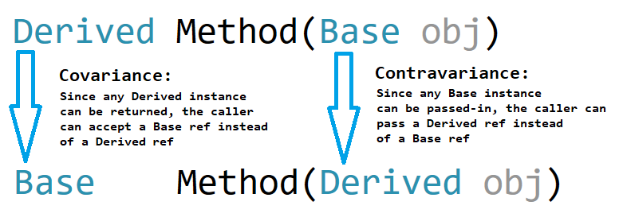

# What is Covariance and Contravariance?
- **Covariance** and **contravariance** are terms that refer to the ability to use a more derived type (more specific) or a less derived type (less specific) than originally specified.
- covariance and contravariance enable implicit reference conversion for array types, delegate types, and generic type arguments.
- Covariance and Contravariance provide greater flexibility in assigning and using generic types.
- Covariance preserves assignment compatibility and contravariance reverses it.

## Covariance
- Enables you to use a more derived type than originally specified.
- You can assign an instance of IEnumerable<Derived> to a variable of type IEnumerable<Base>.
 
## Contravariance
- Enables you to use a more generic (less derived) type than originally specified.
- You can assign an instance of Action<Base> to a variable of type Action<Derived>.

