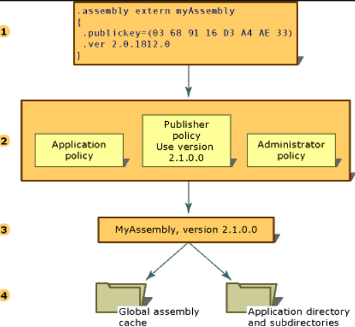

># **Assembly Details**
- Assemblies form the fundamental units of deployment, version control, reuse, activation scoping, and security permissions for .NET-based applications. An assembly is a collection of types and resources that are built to work together and form a logical unit of functionality. Assemblies take the form of executable (.exe) or dynamic link library (.dll) files, and are the building blocks of .NET applications. They provide the common language runtime with the information it needs to be aware of type implementations.
- In .Net 3 types of Assemblies are available: 
   1. Private Assemblies : Private Assemblies are designed to be used by one application and must reside in that application's directory or subdirectory.
   1. Shared Assemblies: Microsoft offers the shared assembly for those components that must be distributed. It centered around two principles. 
      * Firstly, called side-by-side execution, allows the CLR to house multiple versions of the same component on a single machine.
      * Secondly, termed binding, ensures that clients obtain the version of the component they expect.
   1. Satellite Assembly: A satellite Assembly is defined as an assembly with resources only, no executable code.

---
<br>

>## Manifest :

### <span style="color: #3c8f0d;">What is the 'Assembly Manifest' in C#?</span> 
- Every assembly, whether static or dynamic, contains a collection of data that describes how the elements in the assembly relate to each other. 
- The assembly manifest contains this assembly metadata. 
- An assembly manifest contains all the metadata needed to specify the assembly's version 
  requirements and security identity, and all metadata needed to define the scope of the assembly and resolve references to resources and classes.
- The assembly manifest can be stored in either a PE file (an .exe or .dll) with Microsoft intermediate language (MSIL) code or in a standalone PE file that contains only assembly manifest information.
<br>


<br>

### <span style="color: #3c8f0d;">Functions of Assembly Manifest: </span>

- Enumerates the files that make up the assembly.
- Governs how references to the assembly's types and resources map to the files that contain their declarations and implementations.
- Enumerates other assemblies on which the assembly depends.
- Provides a level of indirection between consumers of the assembly and the assembly's implementation details.
- Renders the assembly self-describing.


### <span style="color: #3c8f0d;"> Assembly manifest contents: </span>

|Information          |Description       |
|---             |---               |
|Assembly name| Text string specifying the assembly's name.|
|Version number|A major and minor version number, and a revision and build number. The common language runtime uses these numbers to enforce version policy.|
|Culture| Information on the culture or language the assembly supports. This information should be used only to designate an assembly as a satellite assembly containing culture- or language-specific information.|
|Strong name information|The public key from the publisher if the assembly has been given a strong name.|
|List of all files in the assembly|A hash of each file contained in the assembly and a file name. Note that all files that make up the assembly must be in  the same directory as the file containing the assembly manifest.|
|Type reference information|Information used by the runtime to map a type reference to the file that contains its declaration and implementation. This is used for types that are exported from the assembly.|
|Information on referenced assemblies|A list of other assemblies that are statically referenced by the assembly. Each reference includes the dependent assembly's  name, assembly metadata (version, culture, operating system, and so on), and public key, if the assembly is strong named.|

---
<br>

>## Metadata:


### <span style="color: #3c8f0d;">Introduction to Metadata?</span>
- Metadata is binary information describing your program that is stored either in a common language runtime portable executable (PE) file or in memory. 
- When you compile your code into a PE file, metadata is inserted into one portion of the file, and your code is converted to Microsoft intermediate language (MSIL) and inserted into another portion of the file. Every type and member that is defined and referenced in a module or assembly is described within metadata. When code is executed, the runtime loads metadata into memory and references it to discover information about your code's classes, members, inheritance, and so on.

- Metadata describes every type and member defined in your code in a language-neutral manner. Metadata stores the following information:
    - Description of the assembly.
        Identity (name, version, culture, public key).
        The types that are exported.
        Other assemblies that this assembly depends on.
        Security permissions needed to run.
    - Description of types.
        Name, visibility, base class, and interfaces implemented.
        Members (methods, fields, properties, events, nested types).
    - Attributes.
	    Additional descriptive elements that modify types and members.


### <span style="color: #3c8f0d;">Uses of metadata:
</span>

- It provides description about assembly data types like name, visibility, base class and interfaces etc.
- It provides data members like methods, fields, properties, events and nested types.
- It also provides additional description of the elements that modify types and members.
- It have identity like name, version, public key etc.
- It is a key to simple programming model and it will eliminate the necessity for IDL (Interface Definition Language) files, header files.


### <span style="color: #3c8f0d;">Benefits of Metadata:
</span>

- Self-describing files.
- Language interoperability and easier omponent-based design.
- Attributes.
---
<br>

>## Resource:
- .NET Assemblies can contain various types of resources like images, icons, files, etc. Such resources are mostly static, i.e.; do not keep changing during run time or application wise. Also, such resources are not executable items. So while deploying such assemblies, we need to make sure those resources are intact with the packaged assemblies. Else, assemblies may blow up while executing the resource dependent methods. So as part of deployment strategy, we should embed such resources into the assembly itself.

- The ResourceManager class retrieves resources from a binary .resources file that is embedded in an assembly or from a standalone .resources file. If an app has been localized and localized resources have been deployed in satellite assemblies, it looks up culture-specific resources, provides resource fallback when a localized resource does not exist, and supports resource serialization. <br>
[More about ResourceManager Class](https://docs.microsoft.com/en-us/dotnet/api/system.resources.resourcemanager?view=net-5.0)
```c#
using System.Resources
public class ResourceManager
```
- There are many way to create resource file, one of which is to directly use Visual Studio
   * Use Visual Studio to create a resource file and include it in your project. Visual Studio provides a resource editor that lets you add, delete, and modify resources. At compile time, the resource file is automatically converted to a binary .resources file and embedded in an application assembly or satellite assembly. For more information, see the Resource Files in Visual Studio section.

>#### Resources in .resx files
- Unlike text files, which can only store string resources, XML resource (.resx) files can store strings, binary data such as images, icons, and audio clips, and programmatic objects. A .resx file contains a standard header, which describes the format of the resource entries and specifies the versioning information for the XML that is used to parse the data. The resource file data follows the XML header. Each data item consists of a name/value pair that is contained in a data tag. Its name attribute defines the resource name, and the nested value tag contains the resource value. For string data, the value tag contains the string. [Create resource files](https://docs.microsoft.com/en-us/dotnet/framework/resources/creating-resource-files-for-desktop-apps)
- The following example shows a portion of a .resx file 

```c#
<data name="i1" type="System.Int32, mscorlib">
  <value>20</value>
</data>

<data name="flag" type="System.Drawing.Bitmap, System.Drawing,
    Version=1.0.5000.0, Culture=neutral, PublicKeyToken=b03f5f7f11d50a3a"
    mimetype="application/x-microsoft.net.object.bytearray.base64">
  <value>
    AAEAAAD/////AQAAAAAAAAAMAgAAADtTeX…
  </value>
</data>
```
---
<br>


>## Version:

Version describes a particular form of something at a specific stage, this might or might not be different from the previous form of that specific thing.
- It is a naming convention which also helps in checking the compatibility with the projects.
<br>
**Each assembly has two distinct way of expressing version information:**
The first is using assembly’s version number and the second is using an informational version. 

1. Assembly Version Number
   - The assembly’s version number, which together with the assembly name and culture information, is part of the assembly identity 
1. Information Version
   - An information version, which is a string that represents additional version information included for information purpose only.

### <span style="color: #3c8f0d;">Structure of Version Number </span>
- A version number is nothing but a part of the assembly identity
- The structure is as follows:

| Major Version | Minor Version | Build Number | Revision |
|---------------|---------------|--------------|----------|

*For example, version **1.3.1234.0***

- Major: A higher version number might indicate a major rewrite of a product where backward compatibility cannot be assumed.
<br>
- Minor: Indicates significant enhancement with the intention of backward compatibility. 
<br>
- Build: A difference in build number represents a recompilation of the same source.
<br>
- Revision: Assemblies with the same name, major, and minor version numbers but different revisions are intended to be fully interchangeable. <br>
<br>

- It is stored in the assembly manifest along with other identity information, including the assembly name and public key as well as the information on relationships and identities of other assemblies connected with the application


### <span style="color: #3c8f0d;">The Assignment and Retrieval: </span>

**Assignment**
- Assigning version information number to an assembly is not done by the ‘Version’ class but instead done with AssemblyVersionAttribute.

`[assembly:AssemblyVersionAttribute("2.0.1")]`
<br>

**Retrieval**
Retrieving the current assembly’s assembly version. using the Type.Assembly property to obtain a reference to an Assembly object that represents the assembly that contains the application entry point, and then retrieves its version information.

```c#
using System;
using System.Reflection;

public class Example
{
   public static void Main()
   {
      // Get the version of the current assembly.
      Assembly assem = typeof(Example).Assembly;
      AssemblyName assemName = assem.GetName();
      Version ver = assemName.Version;
      Console.WriteLine("{0}, Version {1}", assemName.Name, ver.ToString());
   }
}
```

---
---
<br>

>## Versioning in Assembly:

- All versions of assemblies that use the common language runtime is done at the assembly level. The specific version of an assembly and the versions of dependent assemblies are recorded in the assembly’s manifest.
<br>
- Assemblies have default version policy 
<br>
-  Versioning is only done on assemblies with strong names.

### <span style="color: #3c8f0d;">Strong-names </span>
- Content of strong-name 
  
| Name | Version Number | Culture | Public Key          | Digital Signature |
|------|----------------|---------|---------------------|-------------------|
|Bob   | 1.0.1234.1     | en-US   | 03 68 91 16 D3 A4 33| *Signature*       |
<br>

- Strong names are unreliable from security perspective.

- Although .Net supports strong-names assemblies, the majority of third-party assemblies do not require strong names.

<br>

 

<br>

1. Checks the original assembly reference
1. Checks for all applicable configuration files to apply version policy.
1. Determines the version that should be bound to the calling assembly.
1. Checks the global assembly cache, codebases, and then checks the application's directory and subdirectories using the probing rules
  <br> 


